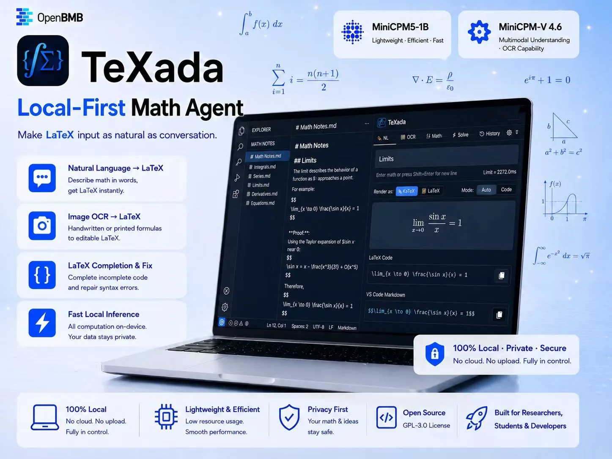

# TeXada

<p align="center">
  <a href="#english">English</a>
  ·
  <a href="#中文">中文</a>
</p>

<p align="center">
  <a href="https://github.com/CacinieP/TeXada-the-Math-Agent/releases"></a>
  <a href="https://github.com/CacinieP/TeXada-the-Math-Agent/actions/workflows/audit.yml"></a>
  <a href="LICENSE"></a>
</p>



<a id="english"></a>

<details open>
<summary><strong>English</strong></summary>

## TeXada

TeXada is a desktop math formula agent for converting natural language, partial LaTeX, and screenshots into usable formula blocks. It is local-first with Ollama + MiniCPM by default, and it can also use any OpenAI API-compatible cloud endpoint.

### Highlights

| Capability | Description |
|------------|-------------|
| Natural language to LaTeX | Describe a formula and get copyable LaTeX or Markdown |
| Formula OCR | Paste or drop screenshots and images for formula recognition |
| Completion | Complete partial LaTeX expressions |
| Validation and repair | Check, fix, render and highlight LaTeX |
| Presets and history | Keep reusable formula presets, search recent conversions, reopen saved results, and reuse prior natural-language or completion inputs |
| Desktop insertion | Click a formula block to type it at the system cursor |
| UI controls | Switch language, zoom from 80% to 140%, and drag the floating window |
| Release packages | macOS DMGs and Windows x64 NSIS installers from GitHub Actions |

The Ollama port is configurable. The default is `http://localhost:11434`, but Settings, `~/.texada/config.json`, and `TEXADA_OLLAMA_HOST` can point TeXada at any host or port.

### Download

Version `0.2.4` is released from the `main` branch.

| Platform | Package |
|----------|---------|
| macOS Apple Silicon | `TeXada_0.2.4_aarch64.dmg` |
| macOS Intel | `TeXada_0.2.4_x64.dmg` |
| Windows x64 | `TeXada_0.2.4_x64-setup.exe` |

Release page: [github.com/CacinieP/TeXada-the-Math-Agent/releases](https://github.com/CacinieP/TeXada-the-Math-Agent/releases)

### From A Fresh Machine To First Formula

TeXada release packages are built for end users. You do not need Python, Node.js, Rust, a source checkout, or a separate FastAPI server.

1. Download the package for your machine from the release page.
   - Apple Silicon Macs use the `aarch64.dmg`.
   - Intel Macs use the `x64.dmg`.
   - Windows PCs use the `x64-setup.exe`.

2. Install and open TeXada.
   - macOS: open the DMG and drag TeXada into Applications.
   - Windows: run the setup EXE and start TeXada from the Start menu.

3. Pick one model path:
   - Local path: install Ollama and pull the default text model. Pull the vision model too if you want OCR.
   - Cloud path: skip Ollama, open Settings, choose `OpenAI-compatible`, enter the provider base URL, text model, vision model and API key, then save.

4. Generate the first formula.
   - Open the `NL` tab.
   - Type `integral of x squared from 0 to 1`.
   - Press `Enter` to run the conversion.
   - Use the copy button, or place the cursor in another app and click the formula block to type it there.

5. Try OCR after the vision model is ready.
   - Paste or drop a screenshot into the OCR tab.
   - If the title bar says `Text ready · OCR missing`, text conversion still works; pull or configure the vision model before OCR.

6. Reuse previous work from History.
   - Open the `History` tab to search saved natural-language, completion, OCR, and LaTeX results.
   - Use the type filter to focus on `Natural`, `Complete`, or `OCR` records.
   - Click `Reuse input` to send a saved natural-language or completion prompt back to the matching tab for editing and rerun.

### Quick Start With Ollama

1. Install Ollama from [ollama.com/download](https://ollama.com/download).
   - macOS: use the official download app.
   - Windows: use the official Windows installer, then launch Ollama once from the Start menu.

2. Pull the default local models. The text model is required for local text conversion; the vision model is required only for local OCR:

```bash
ollama pull hf.co/openbmb/MiniCPM5-1B-GGUF:Q4_K_M
ollama pull openbmb/minicpm-v4.6:latest
```

3. Open TeXada from the downloaded `.dmg` or `.exe`. The packaged app includes the TeXada FastAPI backend and starts it automatically; no separate Python install or manual API server is needed.

4. Check the status in the title bar.
   - `Ready`: text conversion and OCR are available.
   - `Text ready · OCR missing`: text conversion works; pull the vision model shown in the status tooltip.
   - `Model missing`: pull the text model shown in the status tooltip.
   - `Disconnected`: start Ollama or check the configured port.

### Connection Map And Ports

TeXada uses two local HTTP layers. They should normally use different ports:

```text
Desktop UI -> TeXada FastAPI API -> Ollama or cloud model endpoint
```

| Layer | Default | What it is for |
|-------|---------|----------------|
| TeXada FastAPI API | `http://127.0.0.1:18732` | Bundled with the installer and auto-started by the desktop app |
| Ollama model endpoint | `http://localhost:11434` | The FastAPI backend calls local model APIs and adds `/v1` internally |
| Cloud model endpoint | Provider-specific `/v1` base URL | Used only when Backend is `OpenAI-compatible` |

Do not set the FastAPI address and Ollama address to the same port unless you are deliberately running a custom proxy. If Settings shows a network/API error, restart TeXada and check whether `18732` is already occupied. If FastAPI is reachable but status says `Disconnected` or `Model missing`, check Ollama and the model names.

| Role | Default | Notes |
|------|---------|-------|
| Text | `hf.co/openbmb/MiniCPM5-1B-GGUF:Q4_K_M` | Natural language conversion and completion |
| Vision | `openbmb/minicpm-v4.6:latest` | OCR from screenshots and images |
| Cloud | any OpenAI-compatible model | User-defined endpoint, text model, vision model and API key |

The vision slot supports MiniCPM-V 4.6, MiniCPM 5 1B compatible vision endpoints, and OpenAI API-compatible cloud vision models.

Ollama does not have to run on port `11434`. In Settings → Backend → Ollama address, use any reachable endpoint:

```text
http://localhost:11435
http://192.168.1.20:11434
```

Do not add `/v1`; TeXada adds the OpenAI-compatible suffix internally.
For local loopback endpoints, TeXada can try to start `ollama serve` if the Ollama CLI is installed. Remote Ollama endpoints must already be running and reachable.

### Cloud Mode

OpenAI-compatible models can be configured from Settings. For cloud providers, enter the complete Chat Completions base URL expected by that provider; TeXada does not append `/v1` to cloud endpoints. Example:

```json
{
  "backend": "openai_compatible",
  "openai_base_url": "https://your-provider.example/v1",
  "openai_model_name": "your-text-model",
  "openai_vision_model_name": "your-vision-model",
  "openai_api_key": "your-api-key"
}
```

StepFun Step Plan example:

```json
{
  "backend": "openai_compatible",
  "openai_base_url": "https://api.stepfun.com/step_plan/v1",
  "openai_model_name": "step-3.7-flash",
  "openai_vision_model_name": "step-3.7-flash",
  "openai_api_key": "your-api-key"
}
```

The StepFun Step Plan OpenAI-compatible Chat Completions base URL is `https://api.stepfun.com/step_plan/v1`, and `step-3.7-flash` is the recommended validation model in StepFun's public documentation.

### Configuration

Persistent config lives at `~/.texada/config.json`.

```json
{
  "backend": "ollama",
  "ollama_host": "http://localhost:11434",
  "model_name": "hf.co/openbmb/MiniCPM5-1B-GGUF:Q4_K_M",
  "vision_model_name": "openbmb/minicpm-v4.6:latest",
  "api_host": "127.0.0.1",
  "api_port": 18732,
  "ui_language": "zh",
  "ui_zoom": 1.0,
  "max_tokens": 2048
}
```

| Variable | Purpose |
|----------|---------|
| `TEXADA_BACKEND` | `ollama` or `openai_compatible` |
| `TEXADA_OLLAMA_HOST` | Local Ollama base URL, including custom ports |
| `TEXADA_MODEL_NAME`, `TEXADA_VISION_MODEL_NAME` | Local text and vision model names |
| `TEXADA_OPENAI_BASE_URL` | Full OpenAI-compatible cloud base URL |
| `TEXADA_OPENAI_MODEL_NAME`, `TEXADA_OPENAI_VISION_MODEL_NAME` | Cloud text and vision model names |
| `TEXADA_OPENAI_API_KEY` | Cloud provider API key |
| `TEXADA_API_HOST`, `TEXADA_API_PORT` | FastAPI bind address |
| `TEXADA_API_BASE` | Explicit desktop shell API base |
| `TEXADA_DISABLE_BUNDLED_BACKEND` | Set to `1` only when you want to manage the FastAPI backend yourself |
| `TEXADA_API_TIMEOUT_SECS` | Desktop API request timeout |
| `TEXADA_INFERENCE_TIMEOUT_SECONDS`, `TEXADA_API_REQUEST_TIMEOUT_SECONDS` | Backend model and HTTP timeouts |
| `TEXADA_UI_LANGUAGE`, `TEXADA_UI_ZOOM` | UI language (`zh` or `en`) and zoom (`0.8` to `1.4`) |

### Privacy And Limits

| Topic | Behavior |
|-------|----------|
| Local Ollama mode | Model requests stay on the configured Ollama endpoint |
| Cloud mode | Text and images are sent to the configured provider endpoint |
| API keys | Saved in `~/.texada/config.json`; do not paste keys into public issues |
| OCR uploads | Accepts PNG, JPEG, WebP, BMP and TIFF up to 5 MB |
| Math correctness | Always review generated formulas before using them in final work |

### Troubleshooting

| Symptom | Check |
|---------|-------|
| Settings shows API/network error | Restart TeXada; if it persists, check whether another process already uses `127.0.0.1:18732` |
| Status is `Disconnected` | Ollama is not running or `ollama_host` points to the wrong host/port |
| Status is `Model missing` | Pull the text model shown in the status tooltip |
| Status is `Text ready · OCR missing` | Pull the vision model shown in the status tooltip |
| Cloud mode returns 401/403 | API key, provider base URL, and model name |
| Clicking a formula copies instead of inserting | Browser mode falls back to copy; desktop insertion also needs OS paste automation permission |

### Release CI

GitHub Actions builds release installers manually from `main` and automatically from version tags.

| Workflow | Checks |
|----------|--------|
| `Audit` | Ruff, pytest, pip-audit, npm audit, JS syntax check, Tauri cargo check on macOS and Windows |
| `Desktop Release` | Pre-release audit, PyInstaller FastAPI sidecar, signed and notarized macOS arm64/Intel DMG, Windows x64 NSIS installer, official release publishing |

### Shortcuts

| Action | Shortcut |
|--------|----------|
| Show or hide popup | macOS `Option+Command+T`, Windows `Ctrl+Alt+T` |
| Toggle render mode | macOS `Command+K`, Windows `Ctrl+K` |
| Zoom in | `Command/Ctrl + +` |
| Zoom out | `Command/Ctrl + -` |
| Reset zoom | `Command/Ctrl + 0` |
| Move window | drag the header or empty panel space |

### Hardware And Measurements

The numbers below are real local measurements from 2026-07-07, not synthetic benchmark data. Latency depends on model size, quantization, machine load and whether the model is warm.

Measured environment: Mac Neo, macOS 26.5.1, arm64, Apple A18 Pro, 8GB RAM, local Ollama models.

| Scenario | Recommended hardware |
|----------|----------------------|
| Text conversion and completion | Apple Silicon, Intel i5/Ryzen 5 or better, 8GB RAM |
| Regular screenshot OCR | Apple Silicon M2/M3 class or better, 16GB RAM |
| Heavy OCR or larger models | 16GB+ RAM, discrete GPU, or a cloud vision model |

| Operation | Model | Observed latency |
|-----------|-------|------------------|
| NL to LaTeX, cold | MiniCPM5-1B | 179204.3ms |
| NL to LaTeX, warm | MiniCPM5-1B | 29612.2ms |
| LaTeX completion | MiniCPM5-1B plus rules | 1808.5ms |
| OCR sample | MiniCPM-V 4.6 | 39419.0ms |

### Quality Gate

The current `main` branch has no known blocking issue after the latest audit pass. That means tests and static checks pass; it is not a mathematical promise that no software bug can exist. Maintainer validation details live in [Contributing](.github/CONTRIBUTING.md), [Source audit](docs/audit.md), and GitHub Actions.

### Documentation

| Area | Links |
|------|-------|
| Technical docs | [Docs index](docs/README.md), [Architecture](docs/architecture.md), [Technical report](docs/technical-report.md), [Source audit](docs/audit.md), [File inventory](docs/file-inventory.md) |
| Community | [Contributing](.github/CONTRIBUTING.md), [Security](.github/SECURITY.md), [Support](.github/SUPPORT.md), [Code of Conduct](.github/CODE_OF_CONDUCT.md), [Changelog](CHANGELOG.md) |

### License

TeXada-the-Math-Agent is released under `GPL-3.0-or-later`. See [LICENSE](LICENSE).

</details>

<a id="中文"></a>

<details>
<summary><strong>中文</strong></summary>

## TeXada

TeXada 是一个面向数学写作、公式整理和截图识别的桌面公式 Agent。默认本地使用 Ollama + MiniCPM，也支持任何 OpenAI API 兼容的云侧模型。

### 亮点

| 能力 | 说明 |
|------|------|
| 自然语言转 LaTeX | 输入公式描述，生成可复制的 LaTeX 或 Markdown |
| 公式 OCR | 粘贴或拖入截图/图片来识别公式 |
| 公式补全 | 补全未写完的 LaTeX 表达式 |
| 校验与修复 | 检查、修复、渲染并高亮 LaTeX |
| 预设与历史 | 保存常用公式预设，搜索最近转换记录，重新打开已保存结果，并复用历史自然语言或补全输入 |
| 桌面键入 | 点击公式块即可在系统当前光标处键入公式 |
| 界面控制 | 设置页切换中英文、80% 到 140% 缩放、拖动浮窗 |
| 安装包发布 | GitHub Actions 构建 macOS DMG 和 Windows x64 NSIS 安装包 |

Ollama 端口不是写死的。默认地址是 `http://localhost:11434`，但可以在设置页、`~/.texada/config.json` 或 `TEXADA_OLLAMA_HOST` 中改为任意主机和端口。

### 下载

版本 `0.2.4` 从 `main` 分支发布。

| 平台 | 安装包 |
|------|--------|
| macOS Apple Silicon | `TeXada_0.2.4_aarch64.dmg` |
| macOS Intel | `TeXada_0.2.4_x64.dmg` |
| Windows x64 | `TeXada_0.2.4_x64-setup.exe` |

Release 页面：[github.com/CacinieP/TeXada-the-Math-Agent/releases](https://github.com/CacinieP/TeXada-the-Math-Agent/releases)

### 从裸机到第一次使用

TeXada 的 release 安装包面向普通用户。你不需要安装 Python、Node.js、Rust，也不需要拉源码或手动启动 FastAPI 服务。

1. 从 Release 页面下载适合自己机器的安装包。
   - Apple Silicon Mac 选择 `aarch64.dmg`。
   - Intel Mac 选择 `x64.dmg`。
   - Windows 电脑选择 `x64-setup.exe`。

2. 安装并打开 TeXada。
   - macOS：打开 DMG，把 TeXada 拖到 Applications。
   - Windows：运行安装器，然后从开始菜单启动 TeXada。

3. 选择一种模型路线。
   - 本地路线：安装 Ollama，并拉取默认文本模型；如果要用 OCR，再拉取视觉模型。
   - 云侧路线：可以跳过 Ollama；进入设置页，选择 `OpenAI-compatible`，填写 provider base URL、文本模型、视觉模型和 API key，然后保存。

4. 生成第一个公式。
   - 打开 `NL` 页签。
   - 输入 `0 到 1 上 x 平方的积分`。
   - 按 `Enter` 执行转换。
   - 可以点击复制按钮，也可以先把光标放到其他应用里，再点击公式块把公式键入到光标处。

5. 视觉模型准备好后再试 OCR。
   - 在 OCR 页签粘贴或拖入公式截图。
   - 如果标题栏显示 `文本可用 · OCR 缺模型`，文本转换仍可用；OCR 需要先拉取或配置视觉模型。

6. 从历史页复用旧记录。
   - 打开 `历史` 页签，搜索保存过的自然语言、补全、OCR 和 LaTeX 结果。
   - 使用类型筛选专注查看自然语言、补全或 OCR 记录。
   - 点击 `复用输入` 可以把历史自然语言或补全片段送回对应页签，继续编辑或重新生成。

### Ollama 快速启动

1. 从 [ollama.com/download](https://ollama.com/download) 安装 Ollama。
   - macOS：使用官方下载版应用。
   - Windows：使用官方 Windows 安装器，安装后先从开始菜单启动一次 Ollama。

2. 拉取默认本地模型。文本模型用于本地文本转换；视觉模型只在本地 OCR 时必需：

```bash
ollama pull hf.co/openbmb/MiniCPM5-1B-GGUF:Q4_K_M
ollama pull openbmb/minicpm-v4.6:latest
```

3. 打开下载好的 TeXada `.dmg` 或 `.exe` 安装包。安装包内置 TeXada FastAPI 后端，并会在应用启动时自动拉起；不需要单独安装 Python 或手动启动 API 服务。

4. 看标题栏状态。
   - `Ready`：文本转换和 OCR 都可用。
   - `文本可用 · OCR 缺模型`：文本可用，按状态 tooltip 里的命令拉取视觉模型。
   - `模型缺失`：按状态 tooltip 里的命令拉取文本模型。
   - `未连接`：启动 Ollama，或检查配置的端口。

### 连接层级与端口

TeXada 使用两层本地 HTTP 服务。它们通常应该是不同端口：

```text
桌面 UI -> TeXada FastAPI API -> Ollama 或云侧模型 endpoint
```

| 层级 | 默认值 | 用途 |
|------|--------|------|
| TeXada FastAPI API | `http://127.0.0.1:18732` | 随安装包内置，由桌面应用自动启动 |
| Ollama 模型 endpoint | `http://localhost:11434` | FastAPI 后端调用本地模型接口，并在内部自动拼接 `/v1` |
| 云侧模型 endpoint | 服务商提供的 `/v1` base URL | 仅在后端选择 `OpenAI-compatible` 时使用 |

除非你主动配置了自定义代理，不要把 FastAPI 地址和 Ollama 地址设成同一个端口。如果设置页显示 API/网络错误，先重启 TeXada，并检查 `18732` 是否已被其他进程占用；如果 FastAPI 可达但状态是 `未连接` 或 `模型缺失`，再检查 Ollama 和模型名。

| 角色 | 默认模型 | 说明 |
|------|----------|------|
| 文本 | `hf.co/openbmb/MiniCPM5-1B-GGUF:Q4_K_M` | 自然语言转换和补全 |
| 视觉 | `openbmb/minicpm-v4.6:latest` | 从截图和图片识别公式 |
| 云侧 | 任意 OpenAI API 兼容模型 | 自定义 endpoint、文本模型、视觉模型和 API key |

视觉模型位支持 MiniCPM-V 4.6、MiniCPM 5 1B 兼容视觉端点，以及 OpenAI API 兼容的云侧视觉模型。

Ollama 不必固定在 `11434`。在设置页 → 后端连接 → Ollama 地址里，可以填任意可访问地址：

```text
http://localhost:11435
http://192.168.1.20:11434
```

不用加 `/v1`，TeXada 会在内部自动拼接 OpenAI-compatible 后缀。
对于本机 loopback 地址，如果已安装 Ollama CLI，TeXada 可以尝试启动 `ollama serve`；远端 Ollama 地址需要你先在远端启动并保证网络可达。

### 云侧模式

OpenAI API 兼容模型可以在设置页配置。云侧 provider 需要填写该服务商要求的完整 Chat Completions base URL；TeXada 不会为云侧 endpoint 自动追加 `/v1`。示例：

```json
{
  "backend": "openai_compatible",
  "openai_base_url": "https://your-provider.example/v1",
  "openai_model_name": "your-text-model",
  "openai_vision_model_name": "your-vision-model",
  "openai_api_key": "your-api-key"
}
```

StepFun Step Plan 的 OpenAI-compatible Chat Completions base URL 是 `https://api.stepfun.com/step_plan/v1`，`step-3.7-flash` 是 StepFun 公开文档里的推荐验证模型。

StepFun Step Plan 示例：

```json
{
  "backend": "openai_compatible",
  "openai_base_url": "https://api.stepfun.com/step_plan/v1",
  "openai_model_name": "step-3.7-flash",
  "openai_vision_model_name": "step-3.7-flash",
  "openai_api_key": "your-api-key"
}
```

### 配置文件

持久配置文件位于 `~/.texada/config.json`。

```json
{
  "backend": "ollama",
  "ollama_host": "http://localhost:11434",
  "model_name": "hf.co/openbmb/MiniCPM5-1B-GGUF:Q4_K_M",
  "vision_model_name": "openbmb/minicpm-v4.6:latest",
  "api_host": "127.0.0.1",
  "api_port": 18732,
  "ui_language": "zh",
  "ui_zoom": 1.0,
  "max_tokens": 2048
}
```

| 环境变量 | 用途 |
|----------|------|
| `TEXADA_BACKEND` | `ollama` 或 `openai_compatible` |
| `TEXADA_OLLAMA_HOST` | 本地 Ollama 地址，支持自定义端口 |
| `TEXADA_MODEL_NAME`, `TEXADA_VISION_MODEL_NAME` | 本地文本模型和视觉模型名称 |
| `TEXADA_OPENAI_BASE_URL` | 完整 OpenAI-compatible 云侧 base URL |
| `TEXADA_OPENAI_MODEL_NAME`, `TEXADA_OPENAI_VISION_MODEL_NAME` | 云侧文本模型和视觉模型名称 |
| `TEXADA_OPENAI_API_KEY` | 云侧 provider API key |
| `TEXADA_API_HOST`, `TEXADA_API_PORT` | FastAPI 监听地址 |
| `TEXADA_API_BASE` | 桌面壳使用的完整 API 地址 |
| `TEXADA_DISABLE_BUNDLED_BACKEND` | 仅当你想自行管理 FastAPI 后端时设为 `1` |
| `TEXADA_API_TIMEOUT_SECS` | 桌面端 API 请求超时时间 |
| `TEXADA_INFERENCE_TIMEOUT_SECONDS`, `TEXADA_API_REQUEST_TIMEOUT_SECONDS` | 后端模型推理和 HTTP 请求超时 |
| `TEXADA_UI_LANGUAGE`, `TEXADA_UI_ZOOM` | 界面语言（`zh` 或 `en`）和缩放（`0.8` 到 `1.4`） |

### 隐私与限制

| 项目 | 行为 |
|------|------|
| 本地 Ollama 模式 | 模型请求只发送到配置的 Ollama endpoint |
| 云侧模式 | 文本和图片会发送到你配置的 provider endpoint |
| API key | 保存在 `~/.texada/config.json`；不要粘贴到公开 issue |
| OCR 上传 | 支持 PNG、JPEG、WebP、BMP、TIFF，最大 5 MB |
| 数学正确性 | 生成公式用于正式内容前仍需人工核对 |

### 故障排查

| 现象 | 检查项 |
|------|--------|
| 设置页显示 API/网络错误 | 重启 TeXada；如果仍存在，检查是否有其他进程占用 `127.0.0.1:18732` |
| 状态是 `未连接` | Ollama 没启动，或 `ollama_host` 主机/端口不对 |
| 状态是 `模型缺失` | 按状态 tooltip 拉取文本模型 |
| 状态是 `文本可用 · OCR 缺模型` | 按状态 tooltip 拉取视觉模型 |
| 云侧模式返回 401/403 | API key、provider base URL 和模型名 |
| 点击公式只复制、不键入 | 浏览器模式会退化为复制；桌面键入还需要系统粘贴自动化权限 |

### Release CI

GitHub Actions 可以手动从 `main` 构建安装包，也会在版本 tag 上自动构建。

| Workflow | 检查内容 |
|----------|----------|
| `Audit` | Ruff、pytest、pip-audit、npm audit、JS 语法检查、macOS/Windows Tauri cargo check |
| `Desktop Release` | 预发布审计、PyInstaller FastAPI sidecar、已签名并公证的 macOS arm64/Intel DMG、Windows x64 NSIS 安装器、正式 release 发布 |

### 快捷键

| 操作 | 快捷键 |
|------|--------|
| 显示或隐藏浮窗 | macOS `Option+Command+T`，Windows `Ctrl+Alt+T` |
| 切换渲染模式 | macOS `Command+K`，Windows `Ctrl+K` |
| 放大 | `Command/Ctrl + +` |
| 缩小 | `Command/Ctrl + -` |
| 重置缩放 | `Command/Ctrl + 0` |
| 移动窗口 | 拖动标题栏或面板空白区域 |

### 硬件与实测

下面是 2026-07-07 的本地实测，不是合成跑分。响应时间会受模型大小、量化方式、机器负载和模型是否已预热影响。

实测环境：Mac Neo，macOS 26.5.1，arm64，Apple A18 Pro，8GB RAM，本地 Ollama 模型。

| 场景 | 推荐硬件 |
|------|----------|
| 文本转换和补全 | Apple Silicon、Intel i5/Ryzen 5 或更高，8GB RAM |
| 常用截图 OCR | Apple Silicon M2/M3 级别或更高，16GB RAM |
| 高频 OCR 或更大模型 | 16GB+ RAM、独立 GPU，或云侧视觉模型 |

| 操作 | 模型 | 实测响应 |
|------|------|----------|
| NL 转 LaTeX，冷启动 | MiniCPM5-1B | 179204.3ms |
| NL 转 LaTeX，预热后 | MiniCPM5-1B | 29612.2ms |
| LaTeX 补全 | MiniCPM5-1B 加规则 | 1808.5ms |
| OCR 示例 | MiniCPM-V 4.6 | 39419.0ms |

### 质量门禁

当前 `main` 分支在最新审计后没有已知阻塞问题。这里的含义是测试和静态检查通过，不是声称软件绝对不可能有 bug。维护者验证细节见 [贡献指南](.github/CONTRIBUTING.md)、[源码审计](docs/audit.md) 和 GitHub Actions。

### 文档

| 类型 | 链接 |
|------|------|
| 技术文档 | [文档索引](docs/README.md)、[架构文档](docs/architecture.md)、[技术报告](docs/technical-report.md)、[源码审计](docs/audit.md)、[文件清单](docs/file-inventory.md) |
| 社区规范 | [贡献指南](.github/CONTRIBUTING.md)、[安全策略](.github/SECURITY.md)、[支持说明](.github/SUPPORT.md)、[行为准则](.github/CODE_OF_CONDUCT.md)、[变更记录](CHANGELOG.md) |

### 开源协议

TeXada-the-Math-Agent 使用 `GPL-3.0-or-later` 协议发布，详见 [LICENSE](LICENSE)。

</details>
