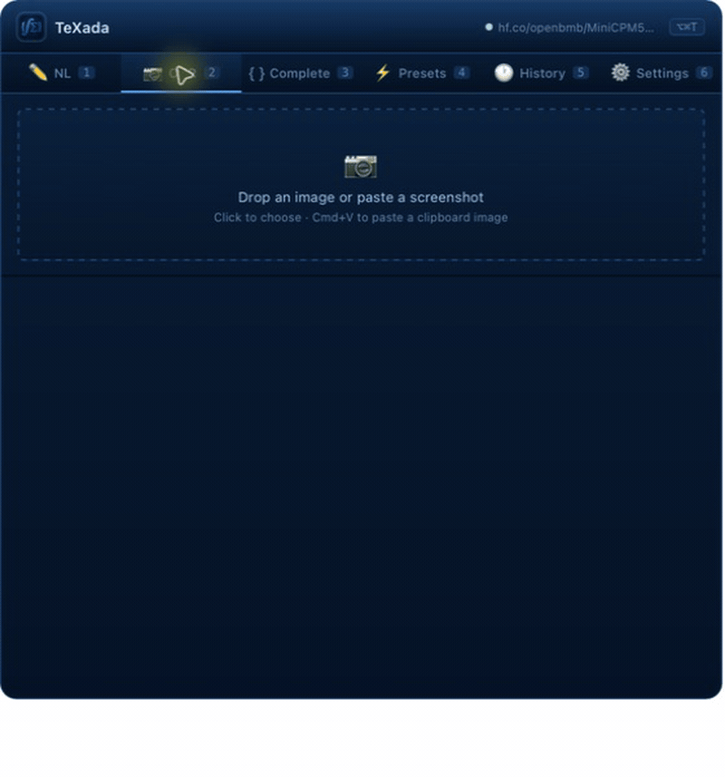

# 02 — Handwritten Formula OCR

Input:


Validated output:

```tex
\int_0^1 x^2\,dx
```



MiniCPM-V 4.6 proposes the OCR candidate. The shared Agent runtime then
compiles and renders the candidate before TeXada marks it valid.
