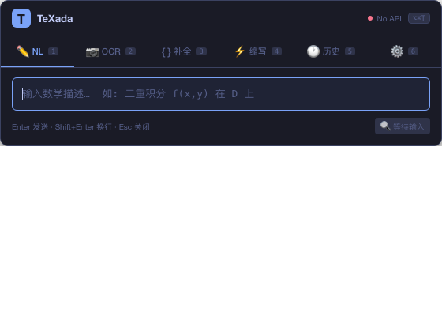
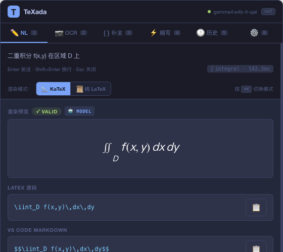
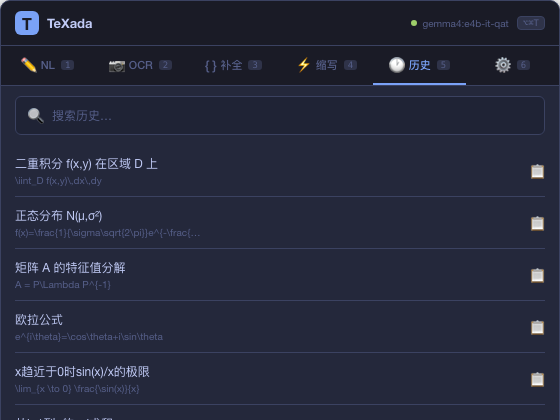

# TeXada — the Math Agent

> 🏆 Gemma 4 Developer Hackathon 2026 | Track A: AI Agent
>
> Local math formula agent powered by **Gemma 4 E4B** with **Native Function Calling**.

## What it does

| Input | Output | Example |
|-------|--------|---------|
| Natural language | LaTeX | `"二重积分 f(x,y) 在 D 上"` → `\iint_D f(x,y)\,dx\,dy` |
| Screenshot / image | LaTeX | Photo of blackboard formula → LaTeX |
| Partial LaTeX | Completion | `\sum_{i=1}^{` → `\sum_{i=1}^{n} x_i` |
| Custom shorthand | Full formula | `"euler"` → `e^{i\pi}+1=0` |

## Architecture

```
┌─────────────┐     ┌──────────────┐     ┌─────────────────┐
│  User Input │────▶│ Intent Router│────▶│ Symbol Engine   │
│ (text/image)│     │ + Memory     │     │ + Shorthand     │
└─────────────┘     └──────────────┘     └─────────────────┘
                                                  │
                           ┌──────────────────────┘
                           ▼
              ┌────────────────────────┐
              │  Gemma 4 E4B  (Ollama) │ ◀── Native Function Calling
              │  • validate_latex      │     • lookup_symbol
              │  • generate_latex      │
              └────────────────────────┘
                           │
              ┌────────────┴────────────┐
              ▼                         ▼
     ┌─────────────────┐      ┌─────────────────┐
     │ LaTeX Validator │      │ Render Engine   │
     │ + Auto-Fixer    │      │ (KaTeX / Pure)  │
     └─────────────────┘      └─────────────────┘
              │                         │
              └────────────┬────────────┘
                           ▼
                    ┌──────────────┐
                    │ Clipboard /  │
                    │ Swift Shell  │
                    └──────────────┘
```

**Key principles:**
1. **Deterministic-first** — Symbol lookup, template filling, and syntax validation are handled by deterministic code. The LLM only handles ambiguous natural language.
2. **Native Function Calling** — Gemma 4 actively calls `validate_latex` and `lookup_symbol` tools during generation, enabling self-correction without prompt engineering.
3. **Agent Memory** — Per-session conversation context lets TeXada understand follow-up queries (e.g. "make it a definite integral" after "integral of x").

## Why Gemma 4 E4B?

| Requirement | Gemma 4 E4B Fit |
|-------------|-----------------|
| **Native Function Calling** | Gemma 4 supports OpenAI-compatible `tools` schema out of the box. |
| **Edge deployment** | 4B params → runs at ~40 tok/s on M1 MacBook Air via Ollama, fully offline. |
| **Multimodal** | Vision-capable E4B variant handles OCR of handwritten formulas. |
| **Math reasoning** | Training data includes STEM corpora; few-shot intent-specific examples boost accuracy. |

We chose **E4B (Efficient 4 Billion)** over larger variants because:
- Latency is critical for a "float-and-type" UX (target <1s end-to-end).
- E4B's QAT (Quantization-Aware Training) maintains function-calling fidelity at INT4 precision.
- Larger models (26B MoE) offer marginal LaTeX accuracy gains but 3× latency penalty.

## Tech Stack

- **LLM:** Gemma 4 E4B via Ollama (local inference, offline)
- **Backend:** Python 3.11+ + FastAPI + `ollama` Python SDK
- **Agent features:** Native Function Calling (`tools` schema) + ConversationMemory
- **LaTeX validation:** `sympy` structural parsing + `katex` CLI rendering
- **Image preprocessing:** OpenCV (grayscale → denoise → multimodal input)
- **Frontend:** Swift + WKWebView floating panel (menu-bar style, macOS)

## Quick Start

### Prerequisites

- macOS 14+ (Swift shell) or any OS with Python (API-only mode)
- [Ollama](https://ollama.com) installed
- Python 3.11+

### 1. Install & start Ollama

```bash
# Pull Gemma 4 E4B (QAT variant)
ollama pull gemma4:e4b-it-qat

# Ensure Ollama server is running
ollama serve
```

### 2. Install Python dependencies

```bash
cd texada
pip install -r requirements.txt
```

### 3. One-shot start

```bash
./start.sh
```

Or manually:

```bash
# Terminal 1 — API server
python -m texada serve

# Terminal 2 — Swift floating shell (macOS)
open tauri-shell/TeXadaShell/TeXadaShell.app
```

### 4. Use it

- **Menu bar:** Click the **𝑇** icon or press `⌥⌘T`
- **Type** a math description → hit `Enter`
- **Copy** result (auto-writes to clipboard) → paste anywhere

## Project Structure

```
texada/
├── src/texada/
│   ├── api.py                 # FastAPI endpoints
│   ├── core/
│   │   ├── router.py          # InputRouter + ConversationMemory + Tool Calling loop
│   │   ├── model.py           # Gemma4E4B wrapper with Native Function Calling
│   │   ├── intent.py          # Zero-model regex intent classifier
│   │   ├── validator.py       # Structural LaTeX validation
│   │   ├── fixer.py           # Auto-fix engine
│   │   ├── symbols.py         # Chinese → LaTeX symbol dictionary
│   │   ├── ocr.py             # Multimodal OCR pipeline
│   │   └── prompts.py         # Few-shot prompt library by intent
│   ├── render/                # KaTeX / pure LaTeX render engines
│   ├── store/                 # Shorthand + history persistence
│   └── types.py               # Shared dataclasses (ToolCall, ToolResult, ConversationTurn)
├── tauri-shell/
│   └── TeXadaShell/           # Swift WKWebView floating panel
├── tests/                     # pytest suite
├── requirements.txt
└── README.md
```

## Native Function Calling in Action

When you type *"积分 sin(x)"*, TeXada does not just prompt the model. It runs an **agent loop**:

1. `IntentClassifier` detects `integral` intent.
2. `InputRouter` injects memory + few-shot examples.
3. **Gemma 4** receives `tools=[validate_latex, lookup_symbol]`.
4. Model may call `lookup_symbol(term="积分")` → returns `\int`.
5. Model generates `\int \sin(x)\,dx`.
6. Model calls `validate_latex(latex="\\int \\sin(x)\\,dx")` → returns `"Valid"`.
7. Final LaTeX returned to user with <1s latency.

This is **not prompt engineering** — it is structured tool use that Gemma 4 natively supports.

## Demo Video

📹 [5-min demo on YouTube / Bilibili] *(add link after recording)*

Screenshots of the Swift floating shell:

| Wake | Result | History |
|------|--------|---------|
|  |  |  |

## License

MIT License — Hackathon submission.
